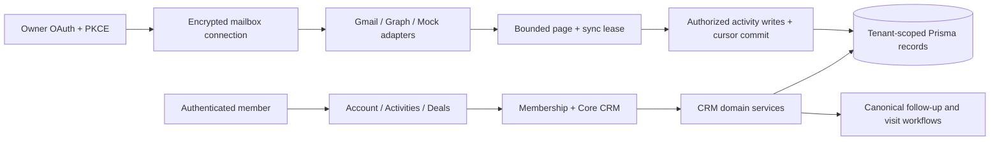

# System overview

Audit baseline: TST `5faee9df930bd76b5e56b669f58a57210527f7d5`, inspected 2026-10-10.

Next.js App Router renders authenticated server pages and uses server actions and route handlers for mutations. Prisma 6 connects to Neon PostgreSQL. Vercel serves the application; scheduled routes, GitHub Actions OHLQ acquisition and Workflow jobs perform bounded background work. Shared Ohio reference records are separate from tenant-owned customer relationships.

## Implementation references

- `app/layout.tsx`
- `lib/prisma.ts`
- `vercel.json`
- `.github/workflows`

## Validation and remaining work

See [implementation progress](../engineering/implementation-progress.md), [feature inventory](../product/feature-inventory.md), and [test report](../releases/v0.2-test-report.md). Existing behavior above is source-audited; it is not a claim of fresh live verification. Changes must update this document and the inventory.

## CRM increment

`lib/crm` now owns activity/privacy/matching, relationship indicators, deal lifecycle and provider-independent mailbox services. `app/activities`, `app/deals` and `app/settings/communications` use existing authentication, Core CRM entitlement, account identities and canonical Worklist actions. They extend the current app rather than replace it.

